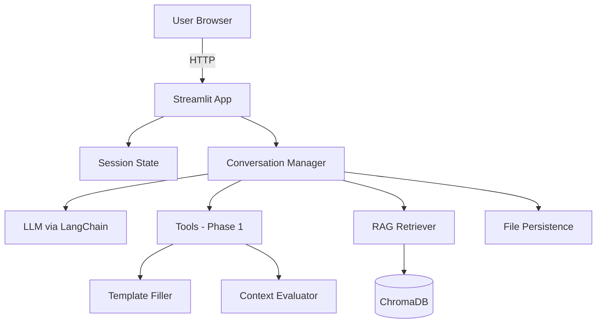
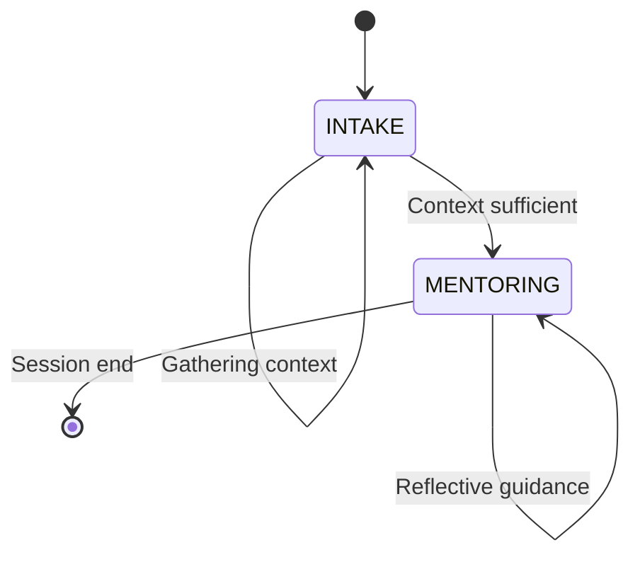

# Technical System Design

## Overview

Technical specification for the OT Mentor AI system implementation. This represents the chosen architecture for the academic thesis project.111111

**Design Philosophy:** Simple, maintainable, provider-agnostic, minimal external dependencies.

---

## System Architecture



**Architecture Characteristics:**
- Single-process application (Streamlit hosts frontend + backend)
- Continuous conversation with phase-specific system messages
- Provider-agnostic LLM integration via LangChain
- Local vector store (ChromaDB)
- Incremental file-based session persistence

---

## Technology Stackwh

| Component | Technology | Purpose |
|-----------|-----------|---------|
| Frontend + Backend Host | Streamlit | UI and application runtime |
| LLM Framework | LangChain (Standard) | Provider abstraction, chain composition |
| Vector Database | ChromaDB | Scenario storage and retrieval |
| LLM Providers | Anthropic / OpenAI / Google | Configurable via environment |
| Session Storage | JSON files | Conversation and template persistence |

**Dependencies:**
- Core: `streamlit`, `langchain`, `langchain-{provider}`, `chromadb`
- Utilities: `pypdf2`, `pydantic`, `python-dotenv`

---
i 
## Operational Workflow

### Phase State Machine



**State Management:**
- Phase stored in `st.session_state.phase`
- Transition triggered by Context Evaluator tool
- No rollback mechanism (forward-only progression)

### Execution Logic

**Conversation Flow:**

1. **Session Start:**
   - Initialize session state (phase=INTAKE, empty template, messages list)
   - Add base system prompt + Phase 1 instructions to messages
   - Create empty template file, conversation log

2. **Phase 1 (INTAKE) Loop:**
   - User sends message → Added to messages
   - **Extract template fields:** Separate LLM invocation with structured output extracts fields from conversation
   - **Evaluate context:** Check if All 5 critical fields + 7 additional = 12/18 total
     - If sufficient: Mark for transition (happens AFTER response)
   - **Generate response:** LLM responds in INTAKE phase context
   - **Clean response:** Remove thinking blocks with regex
   - **Execute transition (if marked):** For NEXT interaction
     - Generate conversation summary from template fields
     - Query ChromaDB → Retrieve top-2 scenarios
     - Add to messages: Phase 2 instructions + Retrieved scenarios
     - Save retrieved scenarios to file
     - Set phase = MENTORING
   - Save conversation state

3. **Phase Transition Notification:**
   - UI displays success message: "✨ Context gathering complete! Transitioning to mentoring phase..."
   - Sidebar updates to show retrieved scenario IDs and titles
   - Page reruns to refresh UI

4. **Phase 2 (MENTORING) Loop:**
   - Continue same conversation (all previous messages preserved)
   - LLM follows Professional Reasoning Framework with scenarios as reference
   - One question at a time, no direct solutions
   - Response cleaning continues
   - Save conversation continuously

5. **Session End:**
   - User ends session
   - All artifacts already saved incrementally

---

## Core Components

### Session State

**Structure:**
```python
{
    "phase": "INTAKE" | "MENTORING",
    "template": {field: value},  # 18-field template
    "chat_history": [{"role": str, "content": str}],
    "retrieved_docs": [{scenario_data}] | None,
    "session_id": "uuid"
}
```

### Tools and Functions

**1. Template Extraction (Automatic)**
- Uses Pydantic structured output with `with_structured_output()`
- Extracts template fields from conversation automatically after each user message in INTAKE phase
- No explicit LLM tool call needed - runs as separate invocation
- Updates template.json incrementally
- Implementation: `_extract_template_fields()` in conversation_manager.py

**2. Context Evaluator (Backend Function)**
- Python function that checks template completeness
- Called after template extraction in INTAKE phase
- Logic: All 5 critical fields filled AND at least 7 additional fields = 12/18 minimum
- Returns: Dict with `{phase, filled, filled_critical, total, total_critical}`
- Critical fields: therapist_role, patient_age, diagnosis, cultural_background, marital_status
- Implementation: `evaluate_context()` in tools.py

**3. RAG Retriever (Backend Function)**
- System function triggered at phase transition
- Queries ChromaDB for relevant scenarios
- Input: Conversation summary generated from template fields
- Returns: Top-K scenarios (K=2) with full content
- Saves retrieved scenarios with metadata (IDs, titles, similarity scores)
- Implementation: `ScenarioRetriever` in rag_retriever.py

**4. Response Cleaner (Backend Function)**
- Filters LLM thinking process from responses
- Uses regex to remove `(Thinking Process: ...)` and `(Internal thoughts: ...)` blocks
- Prevents internal reasoning from appearing in user-facing responses
- Implementation: `_clean_response()` in conversation_manager.py

### LangChain Integration

**Model Configuration:**

Models are configured programmatically with mapping objects:
```python
{
  "technical_name": "gemini-2.0-flash-exp",  # LangChain model identifier
  "provider_api": "google",
  "ui_name": "Gemini Flash 2.5",
  "ui_locked": True  # Initially locked in UI
}
```

**Initial Setup:** Single model (Gemini Flash 2.5) locked in UI, expandable architecture for future models.

**Message Structure:**

Single continuous conversation with accumulative system messages:

```python
# Session start
messages = [
    SystemMessage(BASE_SYSTEM_PROMPT),
    SystemMessage(PHASE_1_INSTRUCTIONS),
]

# Phase 1 builds conversation
messages.extend([
    HumanMessage("User input..."),
    AIMessage("Response..."),
    # ... continues ...
])

# Phase 2: ADD new system messages (no replacement)
messages.extend([
    SystemMessage(PHASE_2_INSTRUCTIONS),
    SystemMessage(f"Retrieved Scenarios:\n{scenario_text}"),
])

# Conversation continues with full context
```

**Key Principles:**
- Single base system prompt shared across phases
- Phase-specific instructions added as SystemMessage objects
- No message replacement - accumulative only
- Full conversation history preserved across phase transition
- Phase determined by which instructions exist in message history (not temporary directives)
- BASE_SYSTEM_PROMPT instructs LLM to watch for Phase 2 instructions and switch behavior
- PHASE_1_INSTRUCTIONS merged scenario usage instructions into PHASE_2_INSTRUCTIONS

### ChromaDB Vector Store

**Setup:**
- Location: `./chroma_db/` (local directory)
- Collection: `ot_scenarios`
- Ingestion: One-time script reads markdown scenarios, stores full documents

**Document Structure:**
```python
{
  "id": "scenario-03",
  "embedding": [0.123, 0.456, ...],  # Gemini Embedding 001
  "document": "full scenario markdown text",
  "metadata": {
    "title": "Dependency & Decision Making"
  }
}
```

**Retrieval:**
- Similarity search using conversation summary embedding (cosine similarity)
- Returns top-K=2 documents with titles and scores
- No re-ranking or hybrid search

**UI Display:**
- When scenarios retrieved, UI shows scenario titles
- User sees: "This resembles: [Scenario A] and [Scenario B]"

---

## RAG Strategy

### Current Approach: Full-Document Embedding with Conversation Summary

**Design Decision:**

The system embeds entire scenario documents and retrieves based on conversation summary similarity.

**Ingestion Phase (One-Time):**
1. Read all 18 scenario markdown files (avg ~1,181 tokens each)
2. Embed each complete scenario using Gemini Embedding 001
3. Store in ChromaDB with metadata (title only)

**Query Phase (At Phase Transition):**
1. Context Evaluator confirms: All 5 critical fields + 7 additional fields filled
2. System generates conversation summary from filled template + chat history
3. Summary is embedded using same embedding model
4. Similarity search against scenario embeddings (cosine similarity)
5. Retrieve top-K=2 scenarios
6. Add to messages: Phase 2 instructions + scenarios + usage instructions
7. Save retrieved scenarios with titles and scores to file
8. Notify user: "This situation resembles Scenario A and Scenario B. Let's explore your thinking..."
9. UI displays scenario titles
10. Transition to MENTORING phase

**Rationale:**
- **Simple implementation:** Standard LangChain pattern, minimal custom code
- **Preserves scenario richness:** Full narrative context available for semantic matching
- **Small dataset optimized:** 18 scenarios × 1.2K tokens = ~21K tokens total (minimal embedding cost)
- **Conversation-aligned retrieval:** Summary captures full context, not just structured fields
- **Academically defensible:** Clear, explainable methodology

**Technical Specifications:**

| Parameter | Value | Rationale |
|-----------|-------|-----------|
| Embedding Model | Gemini Embedding 001 | Large context window, high-quality embeddings, cost-effective |
| Document Granularity | Full scenario (no chunking) | Scenarios avg 1.2K tokens, semantically coherent units |
| Top-K Retrieval | K=2 scenarios (configurable, UI locked) | Balance between context richness and token budget |
| Similarity Metric | Cosine similarity | Standard for dense embeddings |
| Summary Generation | Template fields + conversation context | Captures both structured data and narrative flow |

**Query Construction Example:**
```python
# Template-based summary
summary = f"""
Therapist: {template['therapist_role']}, {template['years_experience']} experience
Patient: {template['patient_age']} year old, {template['diagnosis']}
Setting: {template['setting']}
Main Challenge: {template['main_difficulty']}
Cultural Context: {template['cultural_background']}
"""

# Embed and retrieve
query_embedding = embedding_model.embed(summary)
results = vector_store.similarity_search_by_vector(query_embedding, k=2)
```

---

### Alternative Approaches (Future Consideration)

**1. Template-to-Template Embedding**

Extract structured 18-field templates from scenarios, embed templates, match conversation template to scenario templates directly.

**Advantages:**
- Field-to-field comparison (diagnosis ↔ diagnosis, age ↔ age)
- Highly interpretable retrieval (know exactly why scenarios matched)
- Controlled weighting of critical fields
- Works with sparse templates

**Disadvantages:**
- Requires LLM-based template extraction from each scenario (upfront cost, quality dependency)
- Loses narrative richness (dialogue, therapeutic nuances, patient personality)
- Non-standard implementation (custom retriever required)
- Embedding structured dictionaries is non-trivial (concatenate? multi-vector?)
- Rigid schema dependency

**Implementation Note:** Would require custom `BaseRetriever` subclass with template similarity logic.

---

**2. Metadata Filtering + Semantic Search**

Store full scenario text with template fields as metadata, apply filters then semantic search.

**Advantages:**
- Standard LangChain pattern
- Preserves scenario richness
- Flexible filtering (hard filters on diagnosis, semantic on description)
- Handles sparse data naturally

**Disadvantages:**
- Metadata filtering is binary (match/no-match), not ranked
- Still requires semantic query construction
- May over-filter with small dataset (18 scenarios)

**Implementation:**
```python
# Metadata filtering example
vector_store.similarity_search(
    query="attention regulation challenges in school",
    k=3,
    filter={
        "diagnosis": "ADHD",
        "age_range": "5-10",
        "setting": "School"
    }
)
```

---

**3. HyDE-Inspired Query Generation**

Generate hypothetical scenario description from conversation template, embed synthetic scenario, search.

**Advantages:**
- Leverages existing semantic search (no custom retriever)
- Natural language query from structured template
- Handles sparse templates well

**Disadvantages:**
- Extra LLM call per retrieval (latency, cost)
- Quality depends on generation prompt
- Less interpretable (why did it match?)

**Implementation Flow:**
```
Template → LLM generates synthetic scenario → Embed → Search
```

---

**4. Multi-Vector Retrieval**

Embed multiple representations per scenario (full text, patient profile, therapeutic approach), query with multiple embeddings, re-rank.

**Advantages:**
- Captures both structured and unstructured signals
- Flexible weighting across representations

**Disadvantages:**
- Complex implementation (not built-in to LangChain)
- Higher storage cost (multiple embeddings per scenario)
- Requires custom re-ranking logic

---

### Dataset Characteristics

**From `scripts/calculate-scenario-tokens.py`:**
- Total scenarios: 18
- Total tokens: 21,264
- Average tokens per scenario: 1,181
- Range: 731 - 1,683 tokens

**Implications:**
- Full-document embedding is practical (no chunking needed)
- Small dataset makes complex retrieval optimizations unnecessary
- Could potentially include all scenarios in context if retrieval proves insufficient

---

## Session Persistence

### Incremental Saving Strategy

All artifacts saved continuously as they're produced (not at session end). Ensures crash resilience and real-time debugging.

### Saved Artifacts

Each session maintains three files in `sessions/{session_id}/`:

**1. Template (`template.json`)**

```json
{
  "therapist_role": "Student OT",
  "patient_age": "7",
  "diagnosis": "ADHD",
  ...
}
```

- **Created:** Session start (empty)
- **Updated:** After each Template Filler tool call
- **Final state:** 12+/18 fields filled at phase transition

**2. Retrieved Scenarios (`retrieved_scenarios.json`)**

```json
[
  {
    "id": "scenario-03",
    "title": "Dependency & Decision Making",
    "similarity_score": 0.89
  },
  {
    "id": "scenario-07",
    "title": "...",
    "similarity_score": 0.85
  }
]
```

- **Created:** At phase transition (when RAG retrieval completes)
- **Updated:** Never (one-time retrieval)

**3. Conversation Log (`conversation.json`)**

```json
{
  "session_id": "uuid-abc123",
  "created_at": "2024-11-22T14:30:00Z",
  "phase_transition_at": "2024-11-22T14:45:00Z",
  "model": "gemini-2.0-flash-exp",
  "messages": [
    {"role": "system", "content": "..."},
    {"role": "user", "content": "..."},
    {"role": "assistant", "content": "..."}
  ]
}
```

- **Created:** Session start
- **Updated:** After every message exchange
- **Includes:** All system messages (base + phase instructions + scenarios)

---

## Deployment

### Development Setup

```bash
# 1. Install dependencies
pip install -r requirements.txt

# 2. Configure provider
export LLM_PROVIDER=anthropic
export ANTHROPIC_API_KEY=...

# 3. Ingest scenarios (once)
python ingest_scenarios.py

# 4. Run app
streamlit run app.py
```

Access at `http://localhost:8501`

### Production Deployment

**Target:** Streamlit Community Cloud (free tier)

**Requirements:**
- Include ChromaDB database in repository
- Manage API keys via Streamlit secrets
- No authentication needed (academic use)

---

## Design Rationale

### Single-Process Architecture
- Academic use: 5-10 concurrent testers maximum
- Simplifies debugging and maintenance
- No operational overhead

### Local ChromaDB
- No external service dependencies
- Free and portable
- Sufficient for ~18 scenario documents

### Simple Phase Logic
- Two phases adequate for requirements
- Avoids complexity of graph-based agents
- Easy to understand and modify

### In-Memory Session State
- Built-in Streamlit feature
- Automatic cleanup
- No need for session resume

### Phase Transition Timing
**Decision:** Extract template → Respond in current phase → Transition for next interaction

**Rationale:**
- User expects response to their INTAKE question in INTAKE context
- Template must be current before response (extract before)
- Phase 2 instructions added after response ensures next turn uses new phase
- Prevents jarring immediate phase switch mid-conversation

### Minimal evaluate_context Return
**Decision:** Return dict with only `{phase, filled, filled_critical, total, total_critical}`

**Rationale:**
- Removed redundant data (additional_filled can be derived: filled - filled_critical)
- Removed human-readable messages (UI formats its own display)
- Only essential non-derivative data returned
- Frontend calculates display values as needed

### No Temporary Phase Directives
**Decision:** Phase determined by permanent SystemMessages in history, not temporary injections

**Rationale:**
- Temporary messages were leaking into LLM responses ("CURRENT_PHASE: INTAKE" appeared in output)
- Phase is implicit from which instructions exist in message history
- BASE_SYSTEM_PROMPT tells LLM to watch for Phase 2 instructions and switch behavior
- Simpler mental model: phase = what instructions are present
- Eliminates add/pop pattern complexity

### Response Cleaning
**Decision:** Regex filter to remove LLM thinking blocks before display

**Rationale:**
- Gemini model exposes internal reasoning: "(Thinking Process: ...)"
- This is model behavior, not a prompt issue
- Users shouldn't see internal reasoning in responses
- Regex cleaning is simple, reliable solution
- Patterns: `\(Thinking Process:.*?\)` and `\(Internal thoughts?:.*?\)`

### Consolidated Prompts
**Decision:** Merged SCENARIO_USAGE_INSTRUCTIONS into PHASE_2_INSTRUCTIONS

**Rationale:**
- Scenario usage instructions only relevant in Phase 2
- Having them separate created unnecessary SystemMessage
- Single Phase 2 instruction block is clearer
- Reduces message count in context

---

## Open Questions

**Model Selection:**
- Specific model versions per provider?
- Fixed or user-configurable?

**Template Validation:**
- Strict Pydantic models or loose dictionaries?

**Conversation Summary Generation:**
- Fixed template-based format or LLM-generated natural language?
- Should summary include chat history excerpts or only template data?

**Hebrew Support:**
- RTL text handling in Streamlit?
- Special prompt considerations?

**Evaluation:**
- Additional metrics/logs needed for thesis analysis?
- Track retrieval quality (relevance of retrieved scenarios)?

---

## Status

**Version:** 1.2 - Core Implementation Complete
**Date:** 2025-11-25
**Implementation Status:** Functional system with known UI issue

**Decisions Made:**
- ✅ Model: Gemini Flash 2.5 (locked in UI, programmatically expandable)
- ✅ System prompt: Single base + phase-specific SystemMessages (accumulative)
- ✅ Phase transition: All 5 critical fields + 7 additional = 12/18 minimum
- ✅ RAG approach: Full-document embedding with conversation summary
- ✅ Embedding model: Gemini Embedding 001
- ✅ Dataset: 18 scenarios, no chunking required
- ✅ Retrieval: Top-K=2 scenarios (configurable, UI locked)
- ✅ Persistence: Incremental saving (crash-resilient)
- ✅ Conversation: Continuous across phases (no message replacement)

**Implementation Completed:**
- ✅ Scenario ingestion script with Gemini Embedding 001
- ✅ Conversation manager with phase transition logic
- ✅ Template extraction using Pydantic structured output
- ✅ Conversation summary generation from template
- ✅ Incremental file persistence (template, scenarios, conversation)
- ✅ Streamlit UI with session management and sidebar
- ✅ Phase transition timing (extract before → respond → transition after)
- ✅ LLM thinking process filtering (regex cleaning)
- ✅ Scenario display with IDs in sidebar

**Known Issues:**
- ⚠️ Double message rendering in UI (messages appear grayed out briefly before disappearing)

**Next Steps:**
- Fix double message rendering issue
- Testing with real OT trainees
- Evaluation protocol

---

## References

- [LangChain Documentation](https://python.langchain.com/docs/)
- [ChromaDB Documentation](https://docs.trychroma.com/)
- [Streamlit Documentation](https://docs.streamlit.io/)
- [Reference: RAG Chatbot with Streamlit & LangChain](https://www.youtube.com/watch?v=QlJdyjbAyE0)
